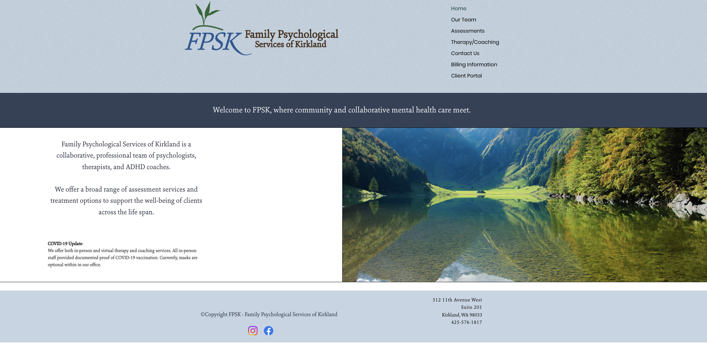
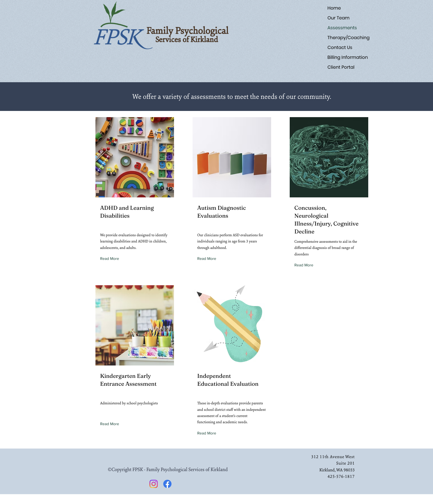
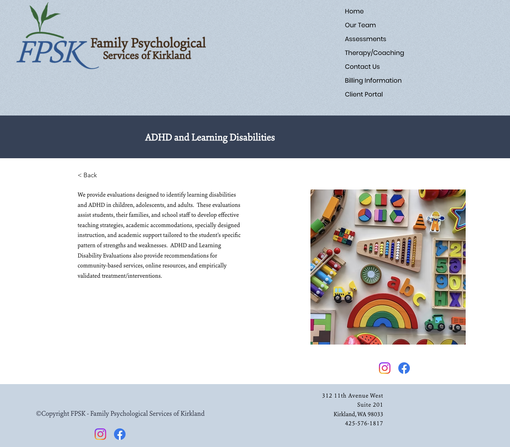
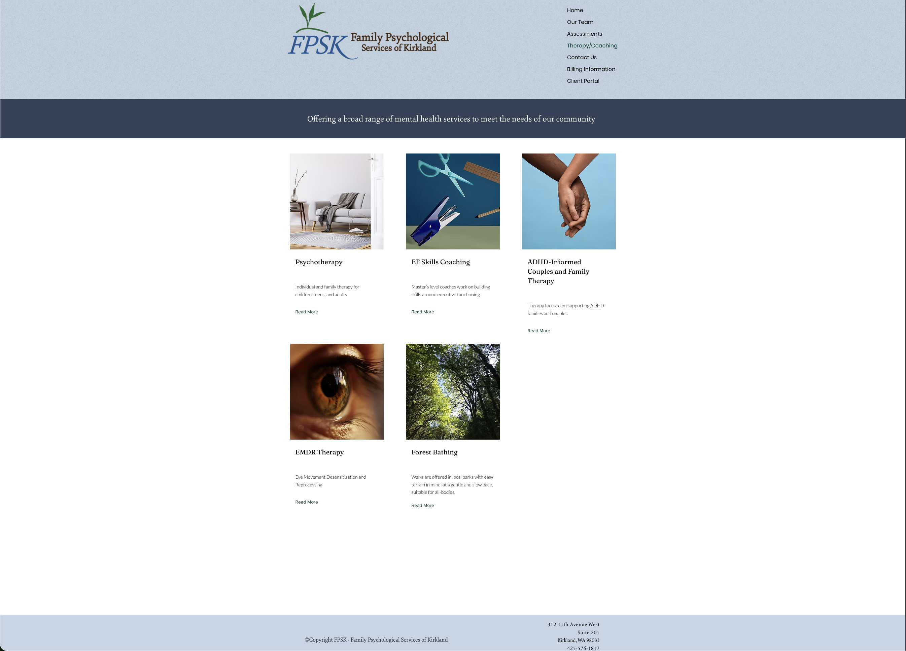
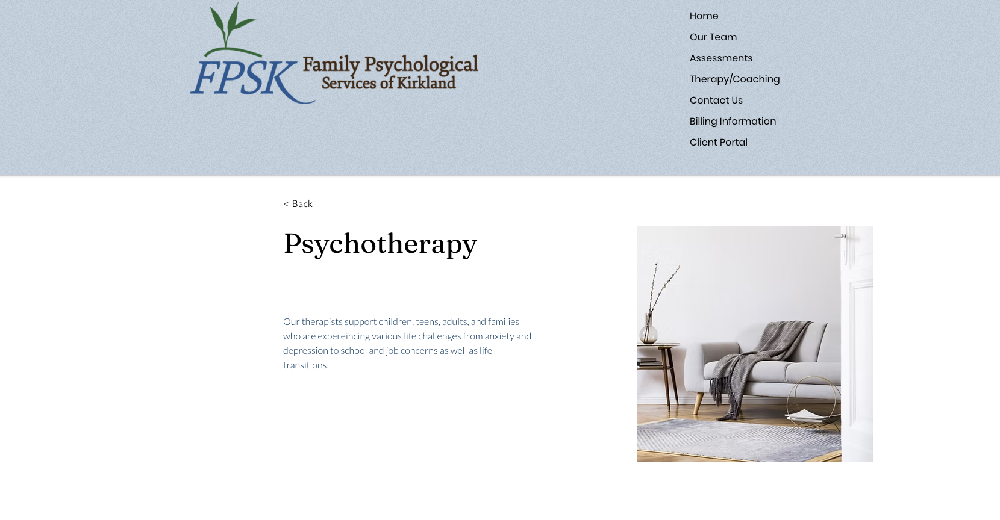
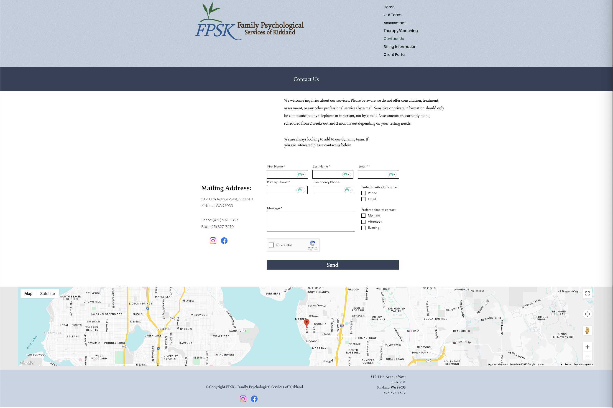
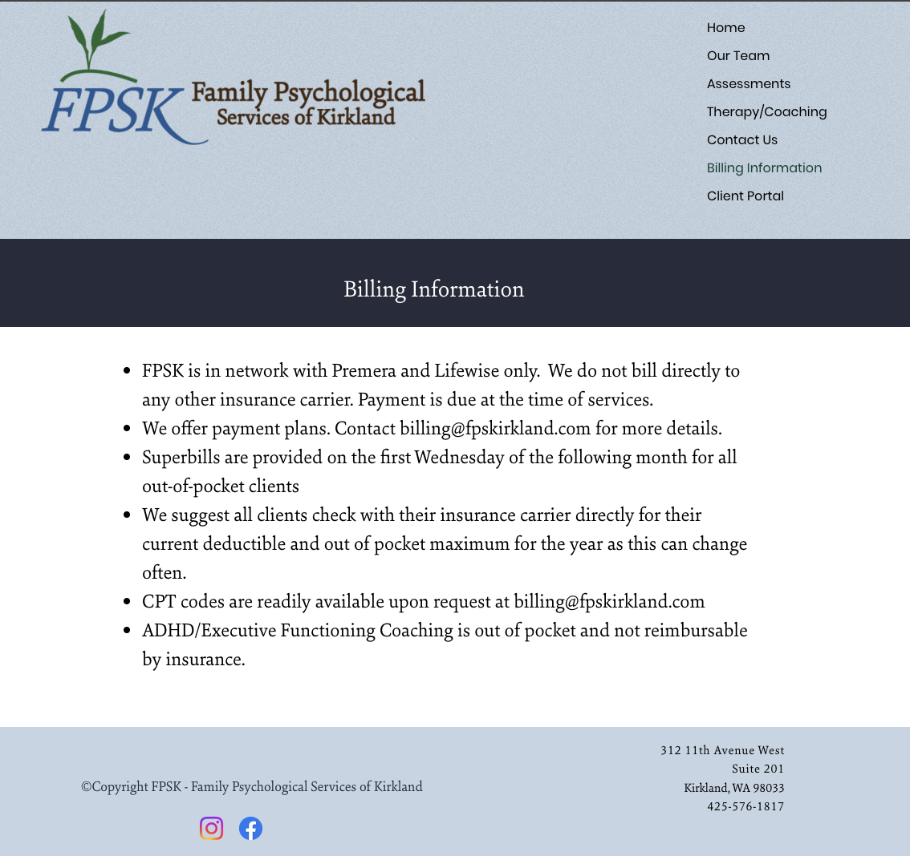
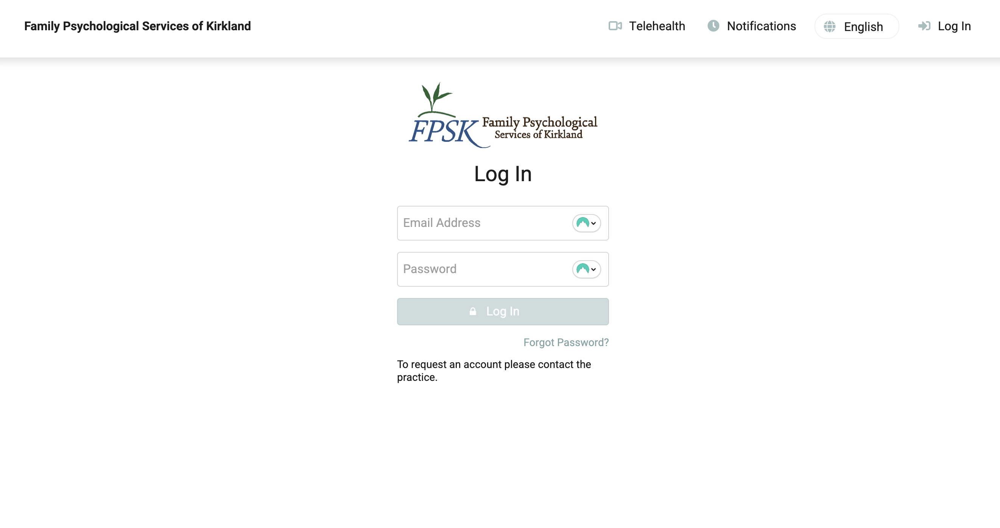

# Current Website Features

- [Current Website Features](#current-website-features)
  - [Home Page](#home-page)
  - [Our Team](#our-team)
  - [Services](#services)
    - [Assessments](#assessments)
    - [Therapy/Coaching](#therapycoaching)
  - [Contact Us](#contact-us)
  - [Billing Information](#billing-information)
  - [Client Portal](#client-portal)
    - [About TherapyPortal](#about-therapyportal)
    - [Features Available Through TherapyPortal](#features-available-through-therapyportal)
    - [Implementation Details](#implementation-details)
    - [Benefits for the Practice](#benefits-for-the-practice)
    - [References](#references)
- [Team Workflow \& Processes](#team-workflow--processes)
  - [Internal Tools \& Systems](#internal-tools--systems)
  - [New Patient Experience](#new-patient-experience)
  - [Existing Patient Experience](#existing-patient-experience)
    - [Portal Capabilities](#portal-capabilities)
    - [In-Person/Office Experience](#in-personoffice-experience)
  - [Additional Questions for Website Improvement](#additional-questions-for-website-improvement)
    - [Appointment Management](#appointment-management)
    - [Communication \& Engagement](#communication--engagement)
    - [Billing \& Payments](#billing--payments)
    - [Documentation \& Forms](#documentation--forms)
    - [Workflow Pain Points](#workflow-pain-points)
    - [Integration Opportunities](#integration-opportunities)
    - [Patient Self-Service Opportunities](#patient-self-service-opportunities)

This document outlines the features and functionality present in the current psychological practice website implementation.

## Home Page

_Features and content to be documented..._

## Our Team

**Feature:** Team member showcase with interactive profiles

- Displays a list of team members
- Each team member entry shows their credentials
- Clicking on a team member reveals additional information/description
- Interactive expandable/collapsible profile details

## Services

**Feature:** Services/Assessments listing page

- Displays a list of assessments/evaluations that the practice provides
- Each assessment is presented as a card with:
  - An image/icon
  - Title
  - Brief description
  - "Read More" link
- Clicking on an assessment (via "Read More" link) reveals additional detailed description
- Grid layout displaying multiple assessment types

### Assessments

The current implementation includes the following assessment types:

1. **ADHD and Learning Disabilities**

   - Evaluations for children, adolescents, and adults
   - Designed to identify learning disabilities and ADHD

2. **Autism Diagnostic Evaluations**

   - ASD evaluations for individuals ranging in age from 3 years through adulthood

3. **Concussion, Neurological Illness/Injury, Cognitive Decline**

   - Comprehensive assessments for differential diagnosis of a broad range of disorders

4. **Kindergarten Early Entrance Assessment**

   - Administered by school psychologists

5. **Independent Educational Evaluation**
   - In-depth evaluations providing parents and school district staff with an independent assessment of a student's current functioning and academic needs

### Therapy/Coaching

**Feature:** Therapy/Coaching services listing page

- Displays a list of therapeutic services and coaching that the practice provides
- Each service is presented as a card with:
  - An image/icon
  - Title
  - Brief description
  - "Read More" link
- Clicking on a service (via "Read More" link) reveals additional detailed description
- Grid layout displaying multiple therapy/coaching service types
- Banner section with mission statement: "Offering a broad range of mental health services to meet the needs of our community"

The current implementation includes the following therapeutic services:

1. **Psychotherapy**

   - Individual and family therapy for children, teens, and adults

2. **EF Skills Coaching**

   - Master's level coaches work on building skills around executive functioning

3. **ADHD-Informed Couples and Family Therapy**

   - Therapy focused on supporting ADHD families and couples

4. **EMDR Therapy**

   - Eye Movement Desensitization and Reprocessing

5. **Forest Bathing**

   - Walks are offered in local parks with easy terrain in mind; at a gentle and slow pace, suitable for all-bodies

## Contact Us

**Feature:** Contact form and information page

- Banner section with "Contact Us" title
- Introductory text explaining:
  - Inquiries about services are welcome
  - Sensitive information should not be communicated via email
  - Assessments are currently scheduled 2 weeks to 2 months out
  - Practice is looking to add to its dynamic team
- Contact form with the following fields:
  - **First Name** (required, text input)
  - **Last Name** (required, text input)
  - **Primary Phone** (required, text input)
  - **Secondary Phone** (optional, text input)
  - **Email** (required, text input)
  - **Message** (required, multi-line text area)
  - **Preferred method of contact:** Radio buttons for "Phone" and "Email"
  - **Preferred time of contact:** Checkboxes for "Morning," "Afternoon," and "Evening"
- reCAPTCHA verification ("I'm not a robot" checkbox)
- Send button to submit the form
- Mailing address and contact information displayed:
  - Address: 312 11th Avenue West, Suite 201, Kirkland, WA 98033
  - Phone: (425) 576-1817
  - Fax: (425) 827-7210
- Social media links (Instagram and Facebook icons)
- Embedded interactive map showing practice location in Kirkland, Washington
- Footer with copyright information and repeated contact details

## Billing Information

**Feature:** Billing policies and information page

- Banner section with "Billing Information" title
- Bulleted list of billing policies and information:
  - **Insurance Coverage:** FPSK is in network with Premera and Lifewise only. The practice does not bill directly to any other insurance carrier. Payment is due at the time of services.
  - **Payment Plans:** Payment plans are available. Contact billing@fpskirkland.com for more details.
  - **Superbills:** Provided on the first Wednesday of the following month for all out-of-pocket clients.
  - **Insurance Verification:** Clients are advised to check with their insurance carrier directly for their current deductible and out-of-pocket maximum for the year, as this can change often.
  - **CPT Codes:** Available upon request at billing@fpskirkland.com
  - **Coaching Services:** ADHD/Executive Functioning Coaching is out of pocket and not reimbursable by insurance.
- Footer with copyright information, social media links, and contact details

## Client Portal

**Feature:** Client portal integration via TherapyPortal

- Navigation link labeled "Client Portal" that redirects to TherapyPortal login page
- Portal URL: [https://www.therapyportal.com/p/fpsk98033/login/](https://www.therapyportal.com/p/fpsk98033/login/)
- Third-party patient portal service provided by TherapyNotes
- Login page features:
  - Practice logo and branding (FPSK Family Psychological Services of Kirkland)
  - Email address and password login fields
  - "Forgot Password?" link
  - Account request information: "To request an account please contact the practice"
  - Navigation options for Telehealth, Notifications, Language selection, and Log In

### About TherapyPortal

TherapyPortal is a HIPAA-compliant patient portal platform designed for mental health and psychological services. It provides clients with secure, 24/7 access to manage various aspects of their care and communication with their providers.

### Features Available Through TherapyPortal

The current website uses TherapyPortal to provide clients with the following capabilities:

1. **Appointment Management**

   - View clinician availability
   - Request new appointments online
   - Reschedule existing appointments
   - Cancel appointments
   - Receive appointment reminders

2. **Telehealth Sessions**

   - Join secure, HIPAA-compliant telehealth sessions remotely
   - Access virtual therapy sessions directly through the portal
   - Connect with participating clinicians for remote consultations

3. **Document Management**

   - Receive documents from therapists electronically
   - Review and electronically sign documents (intake forms, treatment plans, etc.)
   - Complete paperwork digitally
   - Paperless intake process

4. **Secure Messaging**

   - Confidential communication platform between clients and therapists
   - Secure messaging for care coordination
   - Enhanced client engagement and communication

5. **Billing and Payments**
   - View account balances
   - Make credit or debit card payments online
   - Access billing information

### Implementation Details

- **Customization:** The portal can be customized with practice branding (logo, color scheme) to maintain consistent client experience
- **Security:** HIPAA-compliant platform with secure encryption and authentication methods
- **Access:** Clients must log in to their provider's portal to access features and join telehealth sessions
- **Appointment Requests:** Clients can request appointments from participating clinicians through the portal

### Benefits for the Practice

- Streamlines administrative processes
- Reduces phone calls for scheduling and basic inquiries
- Enhances client engagement and accessibility
- Provides secure, compliant communication channel
- Improves overall client experience with modern, convenient access to services

### References

- [TherapyPortal Client Portal Overview](https://support.therapynotes.com/article/104-therapyportal-client-portal)
- [TherapyPortal Login Page](https://www.therapyportal.com/p/fpsk98033/login/)

---

# Team Workflow & Processes

This section documents the internal team workflows, tools, and processes to identify opportunities for automation and improvement in the future website implementation.

## Internal Tools & Systems

**Current Tools Used by FPSK:**

### 1. TherapyNotes

- **URL:** [https://www.therapynotes.com/](https://www.therapynotes.com/)
- **Purpose:** Electronic Health Records (EHR) system
- **Functions:**
  - Scheduling
  - Billing
  - Note taking
  - Practice management

### 2. TherapyPortal

- **URL:** [https://www.therapyportal.com/p/fpsk98033/login/](https://www.therapyportal.com/p/fpsk98033/login/)
- **Purpose:** Patient/client portal (provided by TherapyNotes)
- **Current Usage:**
  - ✅ Known: Client portal for patient access (see [Client Portal](#client-portal) section above)
  - ❓ **Need more information:** Specific internal workflows and how the team uses it for their processes

### 3. Doxy.me

- **URL:** [https://doxy.me/](https://doxy.me/)
- **Purpose:** Telehealth/virtual psychotherapy platform
- **Functions:**
  - Virtual therapy sessions
  - HIPAA-compliant video conferencing
  - Browser-based (no downloads required)
- **Features:**
  - Virtual waiting room
  - Secure video calls
  - Works on desktop and mobile browsers
  - End-to-end encrypted
  - HIPAA, GDPR, SOC2 compliant

### Additional Tools (To Be Determined)

- [ ] Communication tools (email, messaging, etc.)
- [ ] Document management systems
- [ ] Assessment/testing platforms
- [ ] Other tools: **\*\***\_\_\_\_**\*\***

## New Patient Experience

**Question:** When a new patient comes in, what is their first-run experience?

- [ ] Initial contact method (phone, email, contact form, referral)
- [ ] Intake process and required forms
- [ ] Information collected before first appointment
- [ ] How appointments are scheduled for new patients
- [ ] What information is shared with new patients before their first visit
- [ ] First appointment preparation and expectations
- [ ] Documentation and record creation process
- [ ] Portal account setup process
- [ ] Other steps: **\*\***\_\_\_\_**\*\***

## Existing Patient Experience

**Question:** When an existing patient comes in, what is their experience? What can they do through the portal?

### Portal Capabilities

- [ ] Can patients view their files/records?
- [ ] Can patients see their future appointments?
- [ ] Can patients manage their appointments (reschedule, cancel)?
- [ ] Can patients download their reports/documents?
- [ ] Can patients view their billing history?
- [ ] Can patients make payments online?
- [ ] Can patients communicate with providers securely?
- [ ] Can patients access telehealth sessions?
- [ ] Can patients complete forms/questionnaires online?
- [ ] Other capabilities: **\*\***\_\_\_\_**\*\***

### In-Person/Office Experience

- [ ] Check-in process
- [ ] How patients access their information during visits
- [ ] Post-appointment follow-up process
- [ ] How results/reports are shared
- [ ] Other aspects: **\*\***\_\_\_\_**\*\***

## Additional Questions for Website Improvement

### Appointment Management

- [ ] How are appointments currently scheduled? (phone, email, portal, walk-in)
- [ ] What is the cancellation/rescheduling policy and process?
- [ ] How far in advance can patients schedule appointments?
- [ ] Are there different scheduling rules for different service types?
- [ ] How are appointment reminders sent?
- [ ] What happens when appointments are missed or cancelled last-minute?

### Communication & Engagement

- [ ] What are the primary communication channels with patients?
- [ ] How are assessment results communicated to patients?
- [ ] How are treatment plans shared and updated?
- [ ] What information do patients need access to between appointments?
- [ ] How do patients request prescription refills or documentation (e.g., for school/work)?

### Billing & Payments

- [ ] How are invoices/bills generated and sent?
- [ ] What payment methods are accepted?
- [ ] How are payment plans managed?
- [ ] How are insurance claims processed?
- [ ] What billing information do patients need regular access to?
- [ ] How are superbills generated and distributed?

### Documentation & Forms

- [ ] What forms are required for new patients?
- [ ] What forms need to be completed periodically?
- [ ] How are intake forms currently handled?
- [ ] Are there assessment questionnaires that could be completed online?
- [ ] How are consent forms managed?
- [ ] What documents do patients frequently request?

### Workflow Pain Points

- [ ] What manual processes take the most time?
- [ ] What repetitive tasks could be automated?
- [ ] What information gaps exist between systems?
- [ ] What causes the most administrative overhead?
- [ ] What patient requests are most common?
- [ ] What errors or issues occur frequently?

### Integration Opportunities

- [ ] Are there systems that need to communicate with each other?
- [ ] What data needs to be synced between platforms?
- [ ] Are there third-party services that should be integrated?
- [ ] What reporting/analytics would be helpful?
- [ ] Are there compliance requirements that could be automated?

### Patient Self-Service Opportunities

- [ ] What information do patients frequently call/email to ask about?
- [ ] What tasks could patients do themselves if the website supported it?
- [ ] What would reduce phone calls and administrative burden?
- [ ] What would improve patient satisfaction and engagement?

---

**Note:** These questions are being gathered to inform future website improvements and automation opportunities. Answers will be documented as information becomes available.
